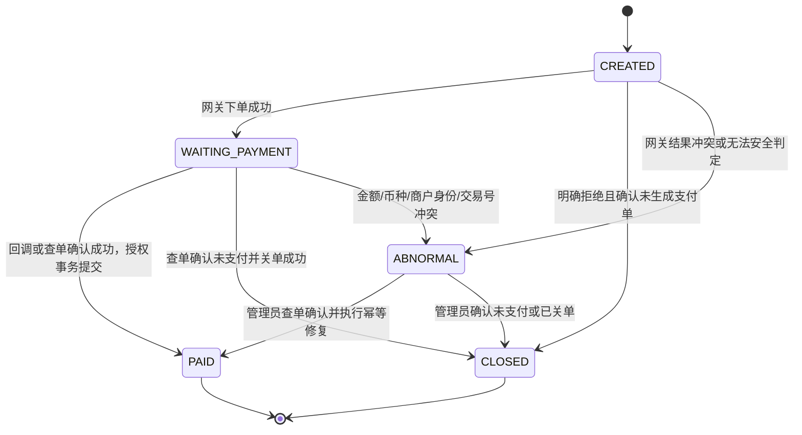

# PAYMENT_V1_IMPLEMENTATION.md

> 项目：武汉理工校园网自动登录小工具<br>
> 文档状态：V1.0 开发约束稿<br>
> 基线日期：2026-07-05<br>
> 适用范围：Windows 客户端、FastAPI 授权服务、微信支付 Native 支付<br>
> 权威级别：支付 V1 业务与技术设计的权威约束<br>
> 正式商业口径：14 天免费试用，9.9 元/年

---

## 0. 文档效力与变更规则

本文档用于约束支付 V1 的设计、编码、测试、部署和审核。后续 Codex、MiMo、CodeRabbit 及人工开发均不得自行改变本文定义的业务规则、状态机、数据边界和安全边界。

本文不覆盖 `AGENTS.md` 中的项目级执行、Git、模型分流和通用安全规则。微信 API 协议以实施时核验的微信支付官方文档为准。

本文使用以下规范词：

- **必须**：不满足即不得合并或发布。
- **禁止**：违反即视为阻断级问题。
- **应当**：除非有明确证据并经重新评审，否则必须遵守。
- **可以**：允许按当前代码风格选择实现方式。
- **暂缓**：V1 不实现，但接口或结构不得阻碍后续扩展。

若本文与早期方案冲突，以本文为准。早期方案中的“7 天试用、8.88 元/年、微信/支付宝二选一、保存原始支付回调正文”等内容全部废止。若项目文档、当前实现和本文冲突，必须先报告，不得静默选择一种解释。

修改本文中的下列内容必须单独评审，不得在普通开发任务中顺手修改：

1. 价格、试用期、授权时长；
2. 支付渠道；
3. 订单状态机；
4. 回调验签、金额校验与幂等规则；
5. 数据库存储白名单；
6. 支付成功后的授权计算方法；
7. 生产环境密钥和 Mock 隔离规则；
8. 支付相关数据库迁移。

---

## 1. 当前项目基线

当前已知基线：

- Windows 客户端采用 Python + PySide6。
- 授权服务采用 FastAPI。
- 授权服务已完成预生产部署。
- 设备指纹、试用状态、正式授权状态、Ed25519 签名授权凭证及客户端验签已经存在。
- 校园网账号和密码只保存在本机，禁止上传服务器。
- Windows PyInstaller 打包基础已通过人工验收，但正式安装器和正式分发尚未完成。
- 当前支付功能仍未接入；预生产授权服务完成，不代表支付预生产闭环完成。
- 支付相关数据库表、Mock 网关和支付客户端尚未实施。
- 当前尚未取得可用于真实联调的微信支付商户参数。
- 本阶段只能先完成支付领域、Mock 闭环和客户端支付交互；真实微信网关在商户资料到位后替换。

在实施支付功能前，Codex 必须先只读确认以下现状，并将结果写入任务报告：

- 当前授权服务数据库类型、连接方式和迁移机制；
- 当前设备标识字段的真实名称；
- 当前授权刷新接口、请求字段和响应字段；
- 当前正式授权记录是单行更新、版本记录还是其他结构；
- 当前服务端时区策略；
- 当前客户端网络请求线程模型；
- 当前预生产与本地开发环境的配置加载方式。

只读确认用于对齐字段和文件位置，不得重新讨论本文已经冻结的架构。

---

## 2. V1 目标

支付 V1 必须形成以下闭环：

```text
客户端创建订单
→ 服务端依据产品目录生成固定金额订单
→ 支付网关返回二维码内容
→ 客户端展示二维码并轮询本系统订单状态
→ 微信回调或服务端主动查单确认支付成功
→ 服务端校验签名、商户身份、订单号、金额、币种和交易状态
→ 数据库事务内确认订单并发放/续期正式授权
→ 客户端刷新签名授权凭证
→ 本地验签并保存
→ UI 显示正式版有效期
```

V1 的核心验收标准不是“出现了二维码”，而是：

> 一笔真实或 Mock 支付只能对应一次授权权益发放；任何伪造、重复、乱序、金额错误或事务失败都不得错误延长授权。

---

## 3. V1 范围

### 3.1 本阶段必须实现

- 服务端产品目录与固定价格；
- 支付订单领域模型；
- 支付订单数据库表；
- 数据最小化的支付通知记录表；
- 独立授权发放账本；
- 订单创建接口；
- 订单状态查询接口；
- `PaymentGateway` 抽象；
- `MockPaymentGateway`；
- Mock 支付成功、失败、重复、乱序、错误金额等测试能力；
- 幂等的正式授权发放/续期服务；
- 客户端支付二维码窗口；
- 客户端有限轮询；
- 客户端支付成功后刷新授权；
- 手动“我已支付，刷新状态”兜底；
- 最小只读后台；
- 异常订单人工修复接口；
- 数据库迁移与回滚预案；
- 支付专项自动测试；
- 预生产 Mock 端到端验收。

### 3.2 商户参数到位后必须实现

- `WeChatNativePaymentGateway`；
- 微信 Native 下单；
- 微信商户订单号查单；
- 微信关单；
- 微信 APIv3 请求签名；
- 微信响应验签；
- 微信支付回调验签；
- APIv3 密钥解密回调资源；
- 微信支付公钥模式；
- 真实回调地址联调；
- 后端查单补偿任务；
- 真实支付小范围联调；
- 生产密钥注入、轮换和泄漏处置说明。

### 3.3 V1 明确不做

- 支付宝；
- H5 支付、JSAPI 支付、小程序支付、APP 支付；
- 自动续费；
- 优惠券、折扣码、分账、多币种；
- 用户账号体系、手机号登录；
- 客户端直接调用微信支付 API；
- 客户端保存微信商户密钥；
- API 自动退款；
- 批量退款；
- 发票功能；
- 多套餐；
- 多设备共享授权；
- 将支付者 OpenID、银行卡类型或优惠明细用于用户画像；
- 把完整回调正文永久落库；
- 为了支付功能上传校园网账号或密码。

退款在 V1 中只允许通过微信商户平台人工处理，程序仅预留售后记录，不实现退款 API。

---

## 4. 冻结的商业参数

服务端必须维护唯一产品目录，客户端无权决定金额、币种和授权时长。

| 参数 | 冻结值 |
|---|---|
| 产品代码 | `annual_v1` |
| 展示名称 | `校园网助手年度授权` |
| 免费试用 | `14` 天 |
| 价格 | `990` 分 |
| 币种 | `CNY` |
| 单次授权时长 | `365` 天 |
| 支付渠道 | `wechat_native` |
| 本地订单支付窗口 | `15` 分钟 |
| 客户端轮询间隔 | `3` 秒 |
| 客户端单次轮询时长 | `120` 秒 |
| 单设备未完成订单上限 | `1` |

约束：

- 金额必须使用整数“分”，禁止使用浮点数 `9.9`。
- 客户端创建订单时只能提交 `plan_code`，禁止提交可信金额。
- 即使客户端提交金额字段，服务端也必须忽略并拒绝该字段。
- 微信回调中的 `amount.total` 必须与数据库订单金额一致。
- 微信回调中的 `amount.currency` 必须为 `CNY`。
- `payer_total` 可能因优惠变化，不作为订单金额一致性判断依据。
- 正式授权到期时间按服务器时间计算，不使用客户端时间。

---

## 5. 总体架构

```text
┌────────────────────────────┐
│ Windows PySide6 客户端      │
│ - 创建订单                  │
│ - 展示二维码                │
│ - 轮询本系统订单状态        │
│ - 刷新并验签授权凭证        │
└──────────────┬─────────────┘
               │ HTTPS
┌──────────────▼─────────────┐
│ FastAPI 授权/支付服务       │
│ - 产品目录                  │
│ - 订单状态机                │
│ - PaymentGateway            │
│ - 回调处理                  │
│ - 授权事务                  │
│ - 后台与审计                │
└───────┬──────────────┬─────┘
        │              │
┌───────▼──────┐  ┌────▼─────────────────┐
│ 项目数据库    │  │ 微信支付 APIv3        │
│ 订单/通知/授权│  │ Native/查单/关单/回调 │
└──────────────┘  └──────────────────────┘
```

关键边界：

- 客户端只与本项目服务端通信。
- 微信签名私钥、APIv3 密钥、微信支付公钥只存在服务端。
- 支付订单与设备指纹哈希绑定。
- 支付确认与授权权益发放属于同一业务事务。
- 客户端显示“支付成功”必须以本项目服务端返回 `PAID` 且授权刷新成功为准。

---

## 6. 环境隔离

必须至少区分：

- `local`
- `preproduction`
- `production`

### 6.1 强制隔离规则

- 三个环境必须使用不同数据库。
- 预生产和生产必须使用不同授权签名私钥。
- 预生产签发的授权 token 不得被正式客户端接受。
- Mock 网关不得在生产环境注册路由。
- 生产环境启动时若 `PAYMENT_PROVIDER=mock`，服务必须拒绝启动。
- 生产环境不得存在 `MOCK_PAYMENT_ADMIN_TOKEN`。
- 预生产 Mock 授权必须带有环境标识，禁止复制到生产。
- 真实商户私钥和 APIv3 密钥不得写入仓库、镜像层、安装包或普通 `.env.example`。

### 6.2 Mock 路由安全

Mock 支付接口只能满足以下条件之一：

1. 仅用于自动测试并绑定本机回环地址；
2. 预生产环境中使用强随机管理员令牌，并由反向代理限制来源 IP；
3. 通过内部管理命令调用，不暴露公网路由。

仅依靠“路径比较隐蔽”不构成安全措施。

---

## 7. 领域模型

### 7.1 订单状态

V1 订单状态固定为：

```text
CREATED
WAITING_PAYMENT
PAID
CLOSED
ABNORMAL
```

不得新增 `SUCCESS`、`PAYING`、`EXPIRED`、`FINISHED` 等同义状态。

| 状态 | 含义 | 是否允许创建新订单 |
|---|---|---|
| `CREATED` | 本地订单已创建，网关结果尚未明确 | 否 |
| `WAITING_PAYMENT` | 已获得二维码内容，等待支付 | 否 |
| `PAID` | 支付已确认，授权权益已在同一事务中发放 | 是 |
| `CLOSED` | 未支付订单已关闭或明确不可继续支付 | 是 |
| `ABNORMAL` | 已收到需要人工处理的支付异常 | 否 |

`ABNORMAL` 会暂时阻止该设备继续创建新订单。管理员必须通过查单、关单或异常处理将其转为 `PAID` 或 `CLOSED`；后台应展示待处理时长并触发告警，禁止异常订单无限期锁死用户设备而无人可见。

`expires_at` 是订单支付窗口截止时间，不单独形成 `EXPIRED` 状态。到期后必须先查单：

- 微信明确返回 `SUCCESS`：进入支付确认事务；
- 微信明确返回 `NOTPAY`：调用关单，成功后进入 `CLOSED`；
- 查询结果不明确：保持原状态并重试；
- 数据冲突：进入 `ABNORMAL`。

### 7.2 状态转换



禁止转换：

- `PAID -> WAITING_PAYMENT`
- `PAID -> CLOSED`
- `CLOSED -> WAITING_PAYMENT`
- 未确认支付成功时直接写入 `PAID`
- 只根据客户端声称“已支付”写入 `PAID`

### 7.3 支付成功定义

支付成功事实统一抽象为 `PaymentEvidence`。它表示经过可信渠道确认的支付事实，至少包含：

- `source`
- `out_trade_no`
- `provider_transaction_id`
- `trade_type`
- `trade_state`
- `amount_fen`
- `currency`
- `paid_at`
- `appid`
- `mchid`
- `provider_notification_id`，可选

`source` 至少允许：

- `wechat_callback`
- `wechat_query`
- `admin_verified_query`
- `mock`

只有同时满足以下条件，订单才可进入 `PAID`：

- 回调签名有效，或主动查单响应验签有效；
- `trade_state == SUCCESS`；
- `trade_type == NATIVE`；
- `mchid` 与服务端配置一致；
- `appid` 与服务端配置一致；
- `out_trade_no` 与数据库订单一致；
- `transaction_id` 非空且未绑定其他订单；
- `amount.total == payment_orders.amount_fen`；
- `amount.currency == payment_orders.currency`；
- 订单绑定设备存在；
- 授权权益发放在同一数据库事务中成功；
- 事务最终提交成功。

### 7.4 续费规则

同一设备允许后续再次购买年度授权。

授权到期时间固定计算为：

```text
base = max(服务器当前时间, 当前正式授权到期时间)
new_expire_at = base + 365 天
```

规则：

- 试用剩余时间不叠加到正式授权。
- 已有正式授权可以叠加年度时长。
- 每个支付订单最多增加一次 365 天权益。
- 权益是否已发放以 `license_grants.source_order_id` 唯一约束为准。
- 不得仅依据当前到期时间推断某订单是否已经发放。

---

## 8. 数据库设计

本文定义字段语义。实际 ORM 类型可按当前代码风格调整，但不得改变语义和约束。

### 8.1 `payment_orders`

| 字段 | 要求 | 说明 |
|---|---|---|
| `id` | PK | 内部订单 ID，建议 ULID/UUID |
| `out_trade_no` | UNIQUE, NOT NULL | 微信商户订单号，6–32 字符 |
| `device_id_hash` | INDEX, NOT NULL | 绑定设备指纹哈希 |
| `plan_code` | NOT NULL | 固定 `annual_v1` |
| `channel` | NOT NULL | `mock_wechat_native` 或 `wechat_native` |
| `status` | INDEX, NOT NULL | 内部状态 |
| `open_slot` | NULL/`open` | 用于限制单设备仅一个未完成订单 |
| `amount_fen` | NOT NULL | 固定 990 |
| `currency` | NOT NULL | 固定 CNY |
| `description` | NOT NULL | 真实商品描述 |
| `provider_code_url` | NULL | 微信 `code_url`，禁止写入日志 |
| `provider_transaction_id` | UNIQUE NULL | 微信支付订单号 |
| `provider_trade_state` | NULL | 最近一次可信渠道状态 |
| `expires_at` | INDEX, NOT NULL | 支付窗口截止时间 |
| `paid_at` | NULL | 微信支付完成时间 |
| `closed_at` | NULL | 关单时间 |
| `last_error_code` | NULL | 安全错误码，不含敏感正文 |
| `last_error_at` | NULL | 最近异常时间 |
| `created_at` | INDEX, NOT NULL | 创建时间 |
| `updated_at` | NOT NULL | 更新时间 |

约束：

```text
UNIQUE(out_trade_no)
UNIQUE(provider_transaction_id) WHERE provider_transaction_id IS NOT NULL
UNIQUE(device_id_hash, open_slot)
CHECK(amount_fen > 0)
```

状态处于 `CREATED`、`WAITING_PAYMENT` 或 `ABNORMAL` 时，`open_slot='open'`。<br>
状态进入 `PAID` 或 `CLOSED` 时，`open_slot=NULL`。

### 8.2 `payment_notifications`

该表只保存审计所需的最小派生字段，禁止保存完整原始回调、完整解密正文、OpenID、银行卡信息和优惠明细。

| 字段 | 要求 | 说明 |
|---|---|---|
| `id` | PK | 本地通知记录 ID |
| `provider_notification_id` | UNIQUE, NOT NULL | 微信通知 `id` |
| `order_id` | INDEX NULL | 关联本地订单 |
| `out_trade_no` | INDEX NULL | 商户订单号 |
| `provider_transaction_id` | INDEX NULL | 微信支付订单号 |
| `event_type` | NOT NULL | 预期 `TRANSACTION.SUCCESS` |
| `signature_key_id` | NULL | `Wechatpay-Serial`，不保存签名正文 |
| `signature_valid` | NOT NULL | 验签结果 |
| `payload_digest_sha256` | NOT NULL | 原始请求体摘要，仅用于审计 |
| `reported_trade_type` | NULL | 解密后的交易类型，预期 `NATIVE` |
| `reported_trade_state` | NULL | 解密后的交易状态，预期 `SUCCESS` |
| `reported_amount_fen` | NULL | 解密后的订单总金额 |
| `reported_currency` | NULL | 解密后的币种 |
| `merchant_identity_valid` | NOT NULL | appid、mchid 是否匹配服务端配置 |
| `process_status` | INDEX, NOT NULL | `RECEIVED/PROCESSING/PROCESSED/RETRY/DUPLICATE/ABNORMAL/ORPHAN` |
| `attempt_count` | NOT NULL | 业务处理尝试次数 |
| `next_attempt_at` | INDEX NULL | 下次重试时间 |
| `failure_code` | NULL | 结构化失败码 |
| `provider_created_at` | NULL | 微信通知创建时间 |
| `received_at` | INDEX, NOT NULL | 服务端接收时间 |
| `processed_at` | NULL | 处理完成时间 |

禁止字段：

- `raw_payload`
- `body_raw`
- `body_decrypted`
- `openid`
- `bank_type`
- 完整请求头
- 完整 `Wechatpay-Signature`
- 完整密文

如果排障确实需要查看原始报文，只允许在受控调试会话中临时采集，必须经过明确审批，设置短期自动删除，并禁止进入普通日志和数据库。

### 8.3 `license_grants`

该表是支付权益发放账本，用于支持续费和数据库级幂等。

| 字段 | 要求 | 说明 |
|---|---|---|
| `id` | PK | 发放记录 ID |
| `source_order_id` | UNIQUE, NOT NULL | 来源订单，核心幂等键 |
| `device_id_hash` | INDEX, NOT NULL | 受益设备 |
| `grant_days` | NOT NULL | 固定 365 |
| `previous_expire_at` | NULL | 发放前正式授权到期时间 |
| `new_expire_at` | NOT NULL | 发放后到期时间 |
| `issued_by` | NOT NULL | `payment_callback/payment_query/admin_repair/mock` |
| `created_at` | INDEX, NOT NULL | 发放时间 |

`license_grants` 不替代现有授权表。支付确认事务必须：

1. 写入 `license_grants`；
2. 更新现有正式授权状态/到期时间；
3. 更新订单为 `PAID`。

### 8.4 现有授权表

不得为了支付功能重建第二套授权系统。

必须复用当前授权表、状态枚举和 Ed25519 token 签发逻辑。允许增加必要字段或适配函数，但禁止：

- 新建与现有授权状态并行的第二份“paid license”状态；
- 让客户端直接使用 `payment_orders.status` 代替授权 token；
- 在支付回调中绕过现有设备绑定；
- 将签名私钥移动到支付模块。

---

## 9. 数据库事务与并发

### 9.1 支付确认事务

`confirm_paid_order(order, evidence, notification=None)` 或语义等效接口必须是唯一的支付确认入口。回调 worker、主动查单、管理员复核和 Mock 都必须调用同一个支付确认服务。

通知接收层只负责把验签、解密后的最小化事件可靠写入 `payment_notifications`。<br>
可靠 worker、主动查单、管理员修复和 Mock 最终都必须调用 `confirm_paid_order()`。`notification` 只在回调路径中必然存在；主动查单和管理员复核不得被迫伪造 notification。所有来源仍必须经过同一金额、币种、交易号、订单状态和幂等校验。

支付确认事务顺序：

```text
开始写事务
→ 锁定或串行化目标 PaymentEvidence、可选 notification 与订单
→ 检查订单是否已 PAID
→ 检查 source_order_id 是否已有 license_grant
→ 再次校验已持久化的可信支付结果
→ 若存在 notification，将 notification 标记为 PROCESSING
→ 写入 license_grants
→ 更新现有正式授权
→ 更新 payment_orders 为 PAID，清空 open_slot
→ 若存在 notification，将 notification 标记为 PROCESSED
→ 提交事务
```

任何一步失败必须全部回滚。

### 9.2 幂等层次

必须同时具备：

1. `payment_notifications.provider_notification_id` 唯一；
2. `payment_orders.provider_transaction_id` 唯一；
3. `license_grants.source_order_id` 唯一；
4. 订单状态检查；
5. 数据库事务串行化。

禁止只使用内存锁、Python 全局变量或“先查再写”实现幂等。

### 9.3 SQLite 兼容

在确认当前预生产数据库前，不得擅自迁移到 MySQL/PostgreSQL。

若当前使用 SQLite：

- 迁移必须向前兼容并先备份数据库；
- 支付写事务应使用 `BEGIN IMMEDIATE` 或 ORM 等效机制；
- 应开启合理的 `busy_timeout`；
- 并发测试必须使用真实文件数据库，不能只使用内存 SQLite；
- 唯一约束冲突必须作为正常幂等分支处理；
- 不得依赖 `SELECT ... FOR UPDATE`。

若未来迁移到 PostgreSQL/MySQL，允许改用行锁，但业务语义和唯一约束不得改变。

---

## 10. PaymentGateway 抽象

业务服务禁止直接依赖微信 SDK 或 HTTP 请求实现。

建议接口：

```python
from typing import Protocol

class PaymentGateway(Protocol):
    def create_native_order(self, request: CreateNativeOrderRequest) -> CreateNativeOrderResult:
        ...

    def query_order(self, out_trade_no: str) -> QueryOrderResult:
        ...

    def close_order(self, out_trade_no: str) -> CloseOrderResult:
        ...

    def parse_and_verify_notification(
        self,
        *,
        headers: Mapping[str, str],
        raw_body: bytes,
    ) -> VerifiedPaymentNotification:
        ...
```

### 10.1 统一输入输出

`CreateNativeOrderRequest` 必须包含：

- `out_trade_no`
- `description`
- `amount_fen`
- `currency`
- `notify_url`
- `expires_at`
- `payer_client_ip`（真实网关要求时）
- 非敏感 `attach`（可为空）

`CreateNativeOrderResult` 必须包含：

- `code_url`
- `provider_state`
- `request_id`（如有）
- 不得向上层返回密钥或完整签名材料

`VerifiedPaymentNotification` 必须只包含业务所需白名单：

- `notification_id`
- `event_type`
- `provider_created_at`
- `appid`
- `mchid`
- `out_trade_no`
- `transaction_id`
- `trade_type`
- `trade_state`
- `amount_total`
- `currency`
- `success_time`

不得包含或持久化 `openid`、银行卡类型、优惠明细。

### 10.2 网关错误分类

统一错误码至少包括：

- `PAYMENT_GATEWAY_TIMEOUT`
- `PAYMENT_GATEWAY_UNAVAILABLE`
- `PAYMENT_GATEWAY_REJECTED`
- `PAYMENT_REQUEST_SIGN_FAILED`
- `PAYMENT_RESPONSE_SIGN_INVALID`
- `PAYMENT_NOTIFY_SIGN_INVALID`
- `PAYMENT_NOTIFY_DECRYPT_FAILED`
- `PAYMENT_NOTIFY_SCHEMA_INVALID`
- `PAYMENT_QUERY_INCONSISTENT`
- `PAYMENT_CLOSE_FAILED`
- `PAYMENT_CONFIG_INVALID`

HTTP 超时或连接中断时，不得立刻创建新商户订单号。必须先使用原 `out_trade_no` 查单，避免上游实际建单成功但本地误判失败。

---

## 11. MockPaymentGateway

Mock 的目标是复现业务边界，不是绕过业务逻辑。

### 11.1 必须支持的场景

- 正常下单；
- 正常支付成功；
- 同一通知重复 2–10 次；
- 不同通知 ID 指向同一订单；
- 两个线程并发确认同一订单；
- 金额错误；
- 币种错误；
- appid 错误；
- mchid 错误；
- 交易类型错误；
- 订单不存在；
- 微信交易号与另一订单冲突；
- 回调延迟；
- 回调先到、客户端后轮询；
- 客户端关闭后支付成功；
- 授权更新故障导致事务回滚；
- 查单确认成功但未收到回调；
- 下单请求超时但查单发现订单存在。

### 11.2 Mock 约束

- Mock 必须生成与真实网关相同形状的领域结果。
- Mock 不得直接改授权表。
- Mock 必须经过 `confirm_paid_order()`。
- Mock 支付产生的授权必须标识环境和 `issued_by=mock`。
- 生产构建不得包含可用的 Mock 成功入口。
- UI 中“模拟支付成功”按钮只允许在明确的开发构建显示。

---

## 12. WeChatNativePaymentGateway

真实实现必须使用微信支付 APIv3。

### 12.1 必要参数

- `appid`
- `mchid`
- 商户 API 证书私钥
- 商户 API 证书序列号
- 微信支付公钥
- 微信支付公钥 ID
- APIv3 密钥
- HTTPS `notify_url`

V1 固定使用微信支付公钥模式，不新增平台证书轮换逻辑，除非官方接口或当前 SDK 强制要求。

### 12.2 必须实现

- `POST /v3/pay/transactions/native`
- 按商户订单号查单
- 关闭订单
- API 请求签名
- API 响应验签
- 回调验签
- `AEAD_AES_256_GCM` 解密
- 主域名失败时的受控重试策略
- 请求超时与结果未知处理

### 12.3 下单字段

由服务端生成并固定：

```json
{
  "appid": "<server config>",
  "mchid": "<server config>",
  "description": "校园网助手年度授权",
  "out_trade_no": "<server generated>",
  "time_expire": "<RFC3339>",
  "notify_url": "<server config>",
  "amount": {
    "total": 990,
    "currency": "CNY"
  }
}
```

`attach` 如使用，只能放内部订单 ID 或固定计划代码，不得放：

- 校园网账号；
- 校园网密码；
- 设备硬件明文；
- 授权 token；
- 手机号；
- 用户姓名。

---

## 13. 服务端 API 合同

实际部署前缀可与现有 FastAPI 路由统一，但资源语义和字段不得改变。

### 13.1 创建订单

```http
POST /api/v1/payment/orders
```

请求：

```json
{
  "device_id_hash": "<existing canonical field>",
  "plan_code": "annual_v1",
  "client_version": "x.y.z"
}
```

服务端行为：

1. 校验设备存在；
2. 查询该设备未完成订单；
3. 若存在，返回原订单，不创建新单；
4. 从服务端产品目录读取 990/CNY/365 天；
5. 创建本地订单；
6. 调用支付网关；
7. 成功后写入 `code_url` 并转为 `WAITING_PAYMENT`；
8. 返回订单信息。

成功响应：

```json
{
  "order_id": "ord_xxx",
  "status": "WAITING_PAYMENT",
  "plan_code": "annual_v1",
  "amount_fen": 990,
  "currency": "CNY",
  "code_url": "weixin://wxpay/...",
  "expires_at": "2026-07-05T12:15:00+08:00",
  "poll_interval_seconds": 3
}
```

不得返回：

- 商户私钥；
- APIv3 密钥；
- 微信支付公钥；
- 完整上游响应；
- 校园网账号密码；
- 其他设备订单。

### 13.2 查询订单

```http
GET /api/v1/payment/orders/{order_id}
```

请求必须同时证明当前设备与订单绑定。高熵、不可枚举的订单 ID 是最低要求，但 `device_id_hash` 本身不是安全凭证，不得把“只提交设备哈希”视为充分认证。当前设备证明的具体实现必须在代码 P0 对齐阶段根据现有授权机制确定；机制确定前，不得虚构不存在的客户端认证系统，也不得仅凭可枚举短订单号查询。

响应：

```json
{
  "order_id": "ord_xxx",
  "status": "PAID",
  "amount_fen": 990,
  "currency": "CNY",
  "expires_at": "2026-07-05T12:15:00+08:00",
  "paid_at": "2026-07-05T12:03:10+08:00",
  "license_refresh_required": true
}
```

该接口默认只查本地数据库，不得由每次客户端轮询直接触发微信查单，避免放大上游请求。

### 13.3 手动刷新支付状态

```http
POST /api/v1/payment/orders/{order_id}/refresh
```

用途：

- 用户点击“我已支付，刷新状态”；
- 本地订单仍未支付；
- 服务端按限频策略调用微信查单。

约束：

- 每订单至少间隔 10 秒才能主动查单；
- 达到频率限制返回 `429`；
- 查单响应必须验签；
- 查到成功后调用同一 `confirm_paid_order()`；
- 不得由客户端提交“paid=true”。

### 13.4 微信回调

```http
POST /api/v1/payment/wechat/notify
```

该接口不使用客户端鉴权，以微信签名为身份凭证。

### 13.5 Mock 回调

```http
POST /api/v1/internal/payment/mock/orders/{order_id}/succeed
```

只在非生产环境注册，并要求内部管理员鉴权。

`/api/v1/payment/orders`、`/api/v1/payment/orders/{order_id}` 等接口是支付 V1 的目标合同。当前代码或 README 中的 `/payment/create`、`/payment/status` 属于支付骨架；是否保留兼容路由，必须在代码 P0 中检查是否存在已发布客户端依赖。若不存在外部兼容需求，后续可以替换骨架，不需要永久维护两套路由。本轮不修改代码和路由。

### 13.6 授权刷新

必须复用当前正式授权刷新接口和 token 签发逻辑。

语义必须满足：

```json
{
  "license_status": "paid_active",
  "license_expire_at": "2027-07-05T12:03:10+08:00",
  "signed_token": "<signed token>"
}
```

禁止支付模块创建第二个同义刷新接口。

### 13.7 统一错误响应

```json
{
  "error": {
    "code": "PAYMENT_ORDER_NOT_FOUND",
    "message": "未找到该支付订单",
    "retryable": false,
    "request_id": "req_xxx"
  }
}
```

用户消息不得暴露堆栈、SQL、密钥路径、上游完整报文或内部设备标识。

---

## 14. 微信回调处理

### 14.1 V1 处理策略

V1 采用**可靠 Inbox + Worker**：

1. 回调接口在 5 秒内完成验签、解密、最小化字段提取和通知持久化；
2. 只有通知记录成功提交后才返回 `204`；
3. 独立可靠 worker 从数据库领取 `RECEIVED/RETRY` 通知；
4. worker 在同一事务中确认订单并发放授权；
5. 服务重启后仍可继续处理已持久化通知。

禁止使用：

- FastAPI 临时 `BackgroundTasks` 作为唯一可靠机制；
- 内存队列；
- 启动线程后立即返回但不落库；
- 仅依靠微信重复回调恢复业务。

该设计既满足微信支付“快速应答、业务异步处理”的要求，也保证进程在返回 `204` 后崩溃时不会丢失支付事件。

### 14.2 回调接收顺序

```text
读取原始 bytes
→ 读取 Wechatpay-Serial/Signature/Timestamp/Nonce
→ 验证时间戳容差与签名
→ 解析通知外层 JSON
→ 校验 event_type/resource_type/algorithm
→ 使用 APIv3 密钥解密 resource
→ 提取白名单字段
→ 校验 appid/mchid，写入 merchant_identity_valid
→ 计算原始 body SHA-256 摘要
→ 短事务幂等写入 payment_notifications(status=RECEIVED)
→ 提交成功
→ 返回 204
```

回调接收层不得修改正式授权。

回调接收层在完成验签、解密后比较 AppID 和 MchID，并将比较结果写入最小化通知记录中的 `merchant_identity_valid`。即使身份不匹配，也要持久化最小化异常事件；worker 发现 `merchant_identity_valid=false` 时，必须将通知或订单标记为异常、不发授权并触发告警。验签失败时不得信任或持久化解密后的业务字段。

### 14.3 Worker 处理顺序

```text
领取一条 RECEIVED/RETRY 通知并标记 PROCESSING
→ 查询并串行化对应订单
→ 校验 out_trade_no/transaction_id/trade_type/trade_state/amount/currency
→ 若合法，调用 confirm_paid_order
→ 事务内更新订单、license_grants、现有授权和通知状态
→ 提交
```

worker 规则：

- 必须通过数据库状态领取任务，避免多进程重复处理；
- worker 必须通过数据库原子领取通知，记录或等效实现 `processing_started_at`、`lease_expires_at`，并可记录 `worker_id`；
- 只有租约有效的 worker 可以完成当前处理；
- 超过租约仍为 `PROCESSING` 的通知可以被回收，服务重启后必须可恢复；
- 处理失败时写入 `RETRY`、`attempt_count`、`next_attempt_at`；
- 重试采用退避，不得死循环；
- 达到重试上限后进入 `ABNORMAL` 并告警；
- 进程重启时应回收超时停留在 `PROCESSING` 的通知；
- `confirm_paid_order()` 仍需依靠唯一约束保证最终幂等。
- 不得只依靠内存锁。

### 14.4 应答规则

- 验签失败：返回 `401` 或 `400`，不执行业务，不保存完整正文。
- 解密或结构解析失败：返回 `400/500`，记录安全错误码。
- 最小化通知无法持久化：返回 `500`，让微信重试。
- 同一 `provider_notification_id` 已持久化：返回 `204`。
- 通知成功持久化：立即返回 `204`，授权由 worker 处理。
- 金额、币种、appid、mchid 或交易号冲突：
  - 持久化最小事件；
  - worker 将订单/通知标记为 `ABNORMAL`；
  - 不发授权；
  - 触发管理员告警。
- 找不到订单：
  - 持久化 `ORPHAN` 最小事件；
  - 返回 `204`；
  - 进入人工/查单对账队列。

### 14.5 时间与重放防护

- 验签必须使用原始请求体 bytes，禁止 JSON 重序列化后验签。
- 必须校验 `Wechatpay-Timestamp` 与服务器时间的允许偏差。
- 通知 `id` 必须唯一。
- 同一 `transaction_id` 不得绑定多个商户订单。
- 服务器必须使用可靠时间同步。
- 禁止以来源 IP 白名单替代签名验证。

---

## 15. 主动查单与补偿

系统不能只依赖回调。

### 15.1 客户端触发查单

客户端轮询本地订单接口。只有以下情况调用显式刷新接口：

- 用户点击“我已支付，刷新状态”；
- 轮询结束仍未确认；
- 客户端重新打开并发现本地存在未完成订单。

### 15.2 后端补偿任务

真实支付阶段必须增加后端补偿：

- 每 30 秒扫描最近 10 分钟的 `WAITING_PAYMENT`；
- 对符合最小查询间隔的订单查单；
- 明确 `SUCCESS`：确认支付；
- 明确 `NOTPAY` 且已过 `expires_at`：关单；
- `CLOSED`：本地转 `CLOSED`；
- 返回不明确：递增安全计数并延后；
- 达到上限后停止高频查询，保留后台人工刷新能力。

不得无限期每 30 秒查单。

### 15.3 T+1 对账

V1 付费内测前至少形成手工 SOP：

- 每日查看微信商户平台交易记录；
- 对照本地 `PAID` 订单；
- 微信成功、本地未成功：查明后补发授权或退款；
- 本地成功、微信无记录：立即冻结相关授权并调查；
- 对账操作写入管理员审计日志。

自动下载交易账单可以暂缓到 V1.1。

---

## 16. 客户端支付流程

### 16.1 UI 状态

客户端支付窗口状态固定为：

- `IDLE`
- `CREATING_ORDER`
- `WAITING_PAYMENT`
- `REFRESHING`
- `ACTIVATED`
- `TIMEOUT`
- `ERROR`

UI 状态不是服务端支付状态，不得持久化为业务事实。

### 16.2 交互流程

```text
用户点击“激活正式版”
→ 禁用重复点击
→ 创建或复用当前设备未完成订单
→ 显示 9.9 元/年
→ 根据 code_url 渲染二维码
→ 启动 3 秒 QTimer
→ 查询本系统订单
→ PAID 后停止计时器
→ 调用现有授权刷新接口
→ 验证 Ed25519 签名和设备绑定
→ 原子保存 token
→ 刷新主界面和托盘状态
→ 显示激活成功
```

### 16.3 线程与生命周期

- 所有 HTTP 请求必须在非 UI 线程执行。
- `QTimer` 只能负责调度，不能在主线程阻塞网络请求。
- 同一支付窗口最多一个在途查询。
- 上一次查询未完成时不得叠加下一次查询。
- 用户关闭窗口后停止计时器并取消后续 UI 更新。
- 关闭支付窗口不关闭服务端订单。
- 应用退出时不得留下非守护线程阻止进程结束。
- 支付成功后即使窗口已关闭，重新打开应用仍能刷新授权。

### 16.4 二维码

API 的权威字段是 `code_url`。

二维码渲染实现可根据当前依赖选择，但必须：

- 正确处理中文环境和高 DPI；
- 二维码周围保留足够静区；
- 不修改 `code_url`；
- 不在日志打印完整 `code_url`；
- 二维码生成失败时允许复制安全的订单号联系售后；
- 新增二维码依赖必须显式审批并加入 PyInstaller 打包测试。

### 16.5 超时文案

120 秒未确认支付时显示：

> 暂未确认支付结果。若你已经付款，请不要重复支付，可点击“我已支付，刷新状态”或稍后重新打开软件刷新授权。

禁止显示：

- “支付失败，请重新支付”
- “订单不存在，立即再付一次”
- 任何会诱导用户重复付款的文案

### 16.6 本地订单恢复

客户端可仅保存：

- 最近一个 `order_id`
- `expires_at`
- 非敏感 UI 状态

不得保存：

- 微信商户密钥；
- 回调报文；
- 微信交易完整信息；
- 支付者 OpenID。

本地订单恢复信息应与现有配置存储分离，清除校园网账号密码不应删除服务端支付订单或已发授权。

---

## 17. 最小后台

V1 后台只提供支付售后所需功能。

### 17.1 查询

- 按内部订单号查询；
- 按 `out_trade_no` 查询；
- 按微信 `transaction_id` 查询；
- 按设备指纹哈希查询；
- 按订单状态、时间范围筛选；
- 查看授权发放账本；
- 查看通知处理状态；
- 查看异常原因代码。

### 17.2 有限操作

- 主动查单；
- 对 `ABNORMAL` 订单执行人工复核；
- 在确认微信支付成功后调用同一幂等授权服务；
- 冻结授权；
- 标记售后处理结果；
- 关闭确认未支付的订单。

### 17.3 禁止操作

- 直接把数据库订单改成 `PAID`；
- 绕过 `license_grants` 手工增加到期时间；
- 任意修改金额；
- 删除支付通知审计记录；
- 查看或导出校园网密码；
- 无理由补发授权。

### 17.4 管理员审计

每次写操作必须记录：

- 操作者；
- 操作时间；
- 来源 IP；
- 操作类型；
- 目标订单/授权；
- 操作前状态；
- 操作后状态；
- 原因；
- 关联工单或备注。

管理员身份和鉴权方式复用现有部署能力；若当前没有后台鉴权，不得把写接口公开到互联网。

---

## 18. 安全与隐私边界

### 18.1 密钥

以下内容只能存在于服务端密钥管理或受控文件：

- 商户 API 私钥；
- APIv3 密钥；
- 微信支付公钥；
- 微信支付公钥 ID；
- 授权签名私钥；
- Mock 管理员令牌。

文件权限必须最小化。私钥不得通过普通日志、异常堆栈、API 响应或监控标签泄露。

### 18.2 服务端信任边界

服务端不得信任客户端提交的：

- 金额；
- 币种；
- 授权天数；
- 支付成功标记；
- 微信交易号；
- 到期时间；
- `code_url`；
- 回调正文。

客户端只可提交产品代码和设备标识。

### 18.3 数据最小化

支付模块可持久化：

- 订单号；
- 设备指纹哈希；
- 金额和币种；
- 订单状态；
- 微信交易号；
- 通知 ID；
- 验签结果；
- 请求体摘要；
- 授权发放记录；
- 安全错误码；
- 时间戳。

支付模块禁止持久化：

- 校园网账号密码；
- 完整回调正文；
- 完整解密正文；
- OpenID；
- 银行卡类型；
- 优惠券明细；
- 完整签名；
- 私钥/APIv3 密钥；
- 完整授权 token 到普通日志。

### 18.4 限流

建议最低限流：

| 接口 | 限制 |
|---|---|
| 创建订单 | 5 次/分钟/设备 |
| 查询本地订单 | 30 次/分钟/订单 |
| 主动刷新查单 | 6 次/分钟/订单 |
| 授权刷新 | 10 次/分钟/设备 |
| 管理员写操作 | 20 次/分钟/管理员 |

回调接口不以普通限流阻断微信，但应有请求体大小限制、超时和 WAF 基础防护。

---

## 19. 日志与监控

### 19.1 允许的结构化字段

- `request_id`
- `event`
- `status`
- `order_id`
- 脱敏后的 `out_trade_no`
- 脱敏后的 `transaction_id`
- `device_id_hash` 的短摘要
- `amount_fen`
- `currency`
- `failure_code`
- `retry_count`
- `duration_ms`
- `gateway`
- `environment`

### 19.2 禁止日志字段

- 校园网账号密码；
- 完整 `code_url`；
- 完整回调正文；
- 完整 `Wechatpay-Signature`；
- APIv3 密钥；
- 商户私钥；
- 完整授权 token；
- OpenID；
- 数据库连接密码。

### 19.3 必须告警的事件

- 验签失败激增；
- 金额或币种不一致；
- appid/mchid 不一致；
- 同一交易号绑定多个订单；
- 订单进入 `ABNORMAL`；
- 支付确认事务失败；
- 微信成功但本地无订单；
- 生产环境发现 Mock 配置；
- 数据库迁移失败；
- 授权发放与订单状态不一致。

---

## 20. 环境变量

### 20.1 通用

```text
APP_ENV=local|preproduction|production
PAYMENT_PROVIDER=mock|wechat_native
PAYMENT_PLAN_CODE=annual_v1
PAYMENT_PRICE_FEN=990
PAYMENT_CURRENCY=CNY
PAYMENT_LICENSE_DAYS=365
PAYMENT_ORDER_TTL_SECONDS=900
PAYMENT_CLIENT_POLL_SECONDS=3
PAYMENT_CLIENT_POLL_TIMEOUT_SECONDS=120
PAYMENT_HTTP_CONNECT_TIMEOUT_SECONDS=3
PAYMENT_HTTP_READ_TIMEOUT_SECONDS=5
PAYMENT_QUERY_RECONCILE_ENABLED=true|false
PAYMENT_NOTIFICATION_WORKER_ENABLED=true|false
PAYMENT_NOTIFICATION_WORKER_POLL_SECONDS=1
PAYMENT_NOTIFICATION_MAX_ATTEMPTS=8
```

生产环境应当从不可变产品配置读取价格；`PAYMENT_PRICE_FEN=990` 是部署注入和启动校验值，必须与不可变产品目录中的 `annual_v1=990/CNY/365天` 一致。不允许在运行期间修改价格，不允许客户端覆盖；不一致时服务必须拒绝启动。

### 20.2 微信支付

```text
WECHAT_PAY_APP_ID=
WECHAT_PAY_MCH_ID=
WECHAT_PAY_MERCHANT_SERIAL_NO=
WECHAT_PAY_MERCHANT_PRIVATE_KEY_PATH=
WECHAT_PAY_PUBLIC_KEY_ID=
WECHAT_PAY_PUBLIC_KEY_PATH=
WECHAT_PAY_API_V3_KEY=
WECHAT_PAY_NOTIFY_URL=
```

### 20.3 Mock

```text
MOCK_PAYMENT_ADMIN_TOKEN=
```

生产环境禁止设置该变量。

启动校验必须检查：

- 真实网关所需配置是否齐全；
- 私钥文件是否可读且权限合理；
- `notify_url` 是否为公网 HTTPS；
- `notify_url` 不带查询参数；
- 生产环境是否错误启用 Mock；
- 价格是否为 990；
- 币种是否为 CNY。

---

## 21. 数据库迁移约束

支付表属于高风险数据库变更，必须由 Codex 实施或严格审核。

迁移必须：

1. 先检测当前 schema；
2. 自动生成或人工确认备份；
3. 只新增表、索引和必要字段；
4. 不删除现有授权数据；
5. 不重写设备指纹；
6. 不改变现有 token 验签格式；
7. 支持重复执行或明确拒绝重复执行；
8. 在空数据库和现有预生产副本上分别测试；
9. 提供升级失败后的恢复步骤；
10. 合并前验证旧版客户端仍能访问既有授权接口。

禁止在首次支付开发中同时进行数据库引擎迁移。

---

## 22. 测试策略

### 22.1 单元测试

必须覆盖：

- 服务端忽略客户端金额；
- 产品目录返回 990/CNY/365 天；
- 状态转换白名单；
- 非法状态转换拒绝；
- 年度授权计算；
- 连续续费叠加；
- 同一订单重复发放不增加到期时间；
- 不同订单可正常续费；
- 金额错误进入 `ABNORMAL`；
- 币种错误进入 `ABNORMAL`；
- appid/mchid 错误进入 `ABNORMAL`；
- 非 `NATIVE/SUCCESS` 不发授权；
- 原始请求体摘要计算；
- 数据最小化字段白名单；
- 生产环境拒绝 Mock。

### 22.2 数据库与并发测试

必须使用真实文件数据库覆盖：

- 同一通知并发处理；
- 不同通知 ID 并发处理同一订单；
- 同一微信交易号用于两个订单；
- 同一设备并发创建两个订单；
- 授权更新失败时整个事务回滚；
- 订单更新成功但授权账本失败时回滚；
- 唯一约束冲突按幂等成功处理；
- SQLite 锁等待和重试行为。

最终断言：

- 一个订单最多一条 `license_grants`；
- 一个微信交易号最多绑定一个订单；
- `PAID` 必定存在对应授权发放记录；
- 不存在“订单 PAID 但授权未增加”的已提交状态。

### 22.3 API 集成测试

- 创建订单；
- 复用未完成订单；
- 查询其他设备订单被拒绝；
- 轮询接口不调用微信查单；
- 显式刷新接口限频；
- Mock 成功后刷新授权；
- 重复回调返回成功且不重复发放；
- 验签失败不处理；
- 订单不存在产生 `ORPHAN`；
- 回调金额错误不发授权；
- 通知持久化失败返回非 2xx；
- 通知持久化成功后在 5 秒内应答；
- worker 失败后进入 RETRY 并可在重启后恢复；
- worker 并发领取同一通知时只有一个成功处理。

### 22.4 客户端测试

- 创建订单不阻塞 UI；
- 二维码正确显示；
- 3 秒轮询；
- 查询未完成时不叠加请求；
- 120 秒停止；
- 窗口关闭停止 UI 更新；
- 支付成功后自动刷新授权；
- 授权 token 验签失败不写入本地；
- 重新打开客户端可恢复未完成订单；
- 网络中断后允许手动刷新；
- 中文和空格路径下二维码依赖正常打包。

### 22.5 手工验收

Mock 阶段：

- 本地完整闭环；
- 预生产完整闭环；
- 两台 Windows 设备验证设备隔离；
- 客户端关闭后模拟支付，重新打开可激活；
- 连续重复通知 10 次，只延长一次；
- 数据库备份和迁移恢复演练；
- 检查日志无敏感字段。

真实微信阶段：

- 真实 Native 二维码；
- 微信扫码支付；
- 回调验签和解密；
- 主动查单；
- 关单；
- 客户端自动激活；
- 断网/关闭客户端后恢复；
- 重复回调；
- 商户平台与本地订单人工对账。

---

## 23. 实施阶段与分支拆分

### 阶段 P0：只读对齐

输出当前数据库、授权接口、设备字段、客户端线程模型和部署配置。

不修改代码。

### 阶段 P1：支付领域与迁移

建议分支：

```text
feature/payment-domain
```

内容：

- 产品目录；
- 状态枚举；
- `payment_orders`；
- `payment_notifications`；
- `license_grants`；
- 迁移；
- 领域单元测试。

### 阶段 P2：Mock 服务端闭环

```text
feature/payment-mock-server
```

内容：

- `PaymentGateway`；
- `MockPaymentGateway`；
- 建单、查询、Mock 通知；
- `confirm_paid_order()`；
- 并发与幂等测试。

### 阶段 P3：客户端支付窗口

```text
feature/payment-client-ui
```

内容：

- 支付窗口；
- 二维码；
- 轮询；
- 授权刷新；
- 恢复未完成订单；
- Windows 打包测试。

### 阶段 P4：最小后台

```text
feature/payment-admin-minimal
```

内容：

- 查询订单、通知、授权发放；
- 主动查单入口占位；
- 审计日志；
- 有限人工修复。

### 阶段 P5：真实微信支付

```text
feature/wechat-native-payment
```

内容：

- 微信 APIv3；
- 下单、查单、关单；
- 回调验签、解密；
- 补偿任务；
- 真实联调。

每个分支只处理一个阶段，不得混入安装器、自动更新或校园网登录逻辑重构。

---

## 24. 模型分工约束

### 24.1 Codex 必须负责或严格审核

- 支付数据库迁移；
- 订单状态机；
- 并发和事务；
- 幂等授权发放；
- 微信 APIv3 签名与验签；
- 回调解密；
- 金额、币种、商户身份校验；
- 真实支付配置；
- 生产 Mock 隔离；
- 授权续期算法；
- 安全测试；
- 付费内测前最终审计。

### 24.2 MiMo 可以负责

在接口和状态机已冻结后：

- 支付窗口静态布局；
- 普通 UI 文案；
- 只读后台表格；
- 机械性 API schema；
- 测试夹具；
- 文档同步；
- 明确规则下的低风险单元测试。

MiMo 禁止独立实现：

- 回调验签；
- APIv3 解密；
- 金额校验；
- 幂等发授权；
- 数据库迁移；
- 生产密钥加载；
- 并发事务；
- 管理员补发授权。

### 24.3 CodeRabbit

CodeRabbit 只作为审查信号，不是事实来源。其支付相关 Major/Critical 意见必须由 Codex 根据执行路径、测试和数据库约束验证。

---

## 25. 禁止修改范围

除非当前阶段明确授权，否则支付任务不得修改：

- `campus_login` 认证协议；
- 校园网账号密码存储；
- DPAPI/Credential Manager；
- 设备指纹算法；
- Ed25519 算法和 token 格式；
- Windows 自启；
- 托盘生命周期；
- 运行日志白名单；
- 现有正式授权口径；
- 安装器和自动更新；
- 其他学校适配。

发现范围外问题只记录，不顺手修复。

---

## 26. 合并与发布门禁

### 26.1 Mock 阶段合并门禁

- 全量现有测试通过；
- 新增支付测试通过；
- 数据库迁移在副本验证；
- 重复/并发通知只发一次授权；
- 日志无敏感数据；
- 生产环境拒绝 Mock 的测试通过；
- 客户端 UI 不阻塞；
- Windows 打包回归通过；
- CodeRabbit 无未解释 Major/Critical；
- Codex 完成支付核心定向审核。

### 26.2 真实微信阶段发布门禁

- 商户参数合法并与 AppID 绑定；
- 微信支付公钥模式正常；
- 下单响应验签正常；
- 回调签名探测流量不能被误接受；
- APIv3 解密正常；
- 金额、币种、appid、mchid 校验正常；
- 查单补偿正常；
- 关单正常；
- 真实支付端到端通过；
- 密钥未进入仓库和镜像；
- 生产备份、恢复和回滚方案可执行；
- 最小后台和售后 SOP 可用；
- 安全审计完成；
- 付费内测名单和反馈渠道已准备。

---

## 27. V1 最终验收清单

以下项目全部满足，支付 V1 才可视为完成：

- [ ] 服务端价格固定为 990 分；
- [ ] 客户端无法指定可信金额；
- [ ] 同设备只存在一个未完成订单；
- [ ] 订单状态机只有本文五种状态；
- [ ] 支付成功与授权发放在同一事务；
- [ ] `license_grants.source_order_id` 唯一；
- [ ] 重复通知不重复延长；
- [ ] 并发通知不重复延长；
- [ ] 金额错误不发授权；
- [ ] 币种错误不发授权；
- [ ] appid/mchid 错误不发授权；
- [ ] 非 Native 或非 SUCCESS 不发授权；
- [ ] 完整回调正文不持久化；
- [ ] OpenID 不持久化；
- [ ] Mock 不能在生产启用；
- [ ] 客户端只轮询本系统服务端；
- [ ] 客户端查询不直接放大微信查单；
- [ ] 支付窗口不阻塞 UI；
- [ ] 轮询超时不诱导重复付款；
- [ ] 支付后关闭客户端仍可恢复授权；
- [ ] 授权 token 继续由现有 Ed25519 逻辑签发和验证；
- [ ] 校园网账号密码不上传；
- [ ] 预生产和生产密钥、数据库完全隔离；
- [ ] 数据库迁移可备份和恢复；
- [ ] 后台人工修复经过同一幂等服务；
- [ ] 真实支付回调在 5 秒内完成验签、解密、最小化持久化并应答；
- [ ] 回调 worker 可重试、可重启恢复且不重复发放；
- [ ] 未收到回调时存在主动查单补偿；
- [ ] 付费内测前完成专项安全审计。

---

## 28. 官方实现依据

开发和审核时以微信支付官方文档为准，重点参考：

- Native 下单：<br>
  https://pay.wechatpay.cn/doc/v3/merchant/4012791877
- 支付成功回调通知：<br>
  https://pay.wechatpay.cn/doc/v3/merchant/4012791882
- 商户订单号查询订单：<br>
  https://pay.wechatpay.cn/doc/v3/merchant/4012791880
- 关闭订单：<br>
  https://pay.wechatpay.cn/doc/v3/merchant/4012791881
- APIv3 签名和验签：<br>
  https://pay.wechatpay.cn/doc/v3/merchant/4012365342
- 回调报文解密：<br>
  https://pay.wechatpay.cn/doc/v3/merchant/4012071382
- 开发必要参数：<br>
  https://pay.wechatpay.cn/doc/v3/merchant/4013070756
- 支付回调和查单实现指引：<br>
  https://pay.weixin.qq.com/doc/v3/merchant/4012075249

若官方文档在实现时发生变化，Codex 必须先列出差异和影响，再修改本文及代码，不得静默沿用旧接口。

---

## 29. 一句话实施原则

> 客户端只展示和查询，服务端只相信微信验签后的支付事实；订单确认、授权续期和幂等账本必须在同一数据库事务中完成，任何重复、伪造、金额错误或事务失败都不得产生额外授权。
